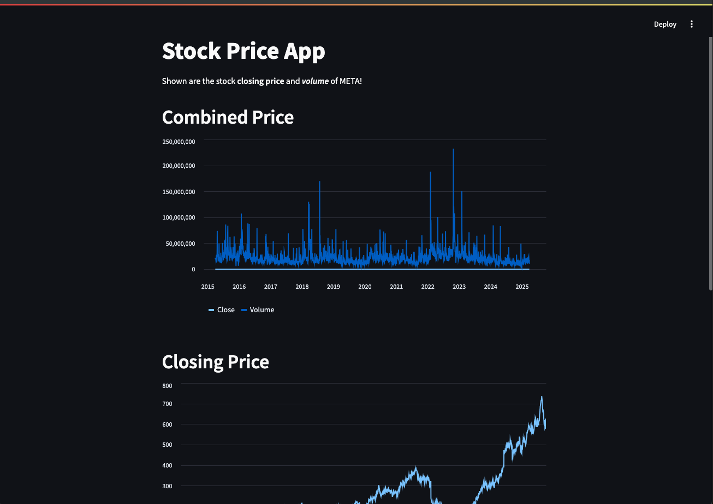
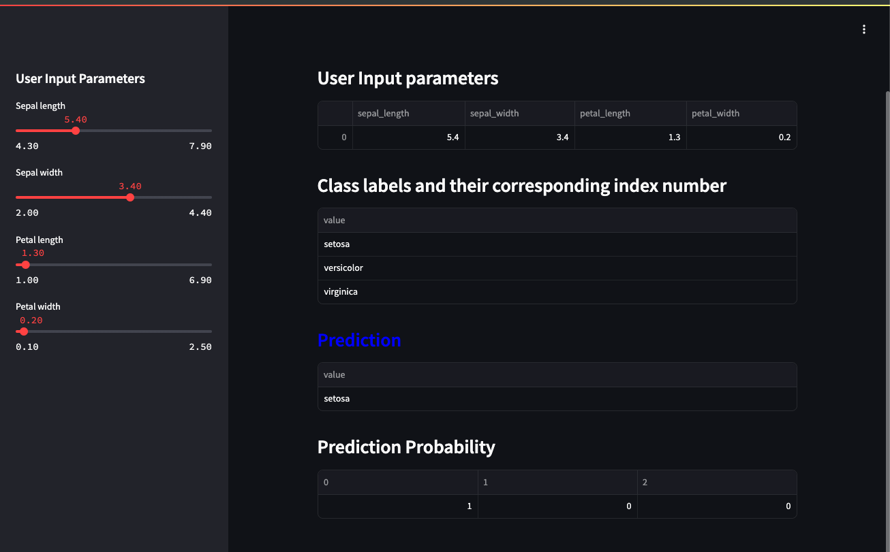
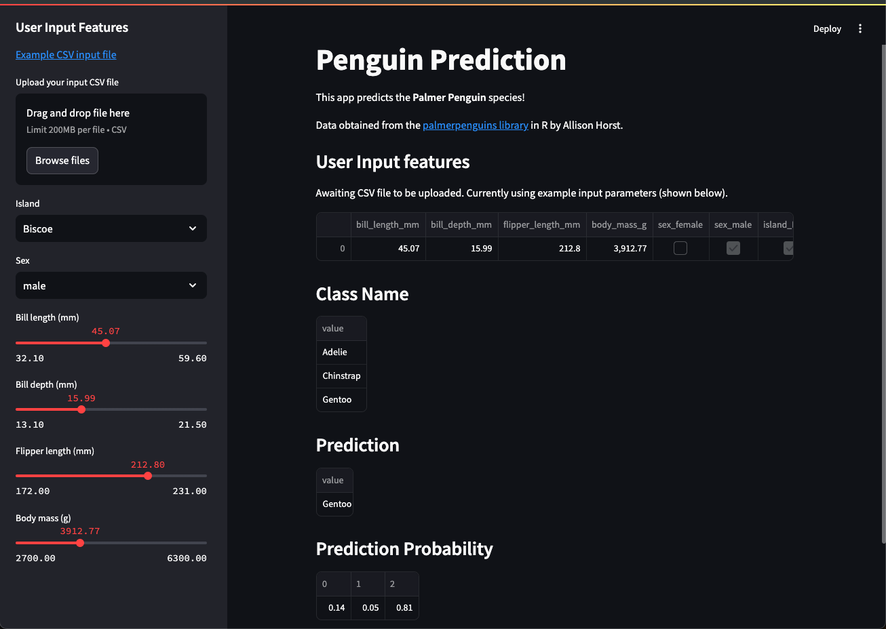
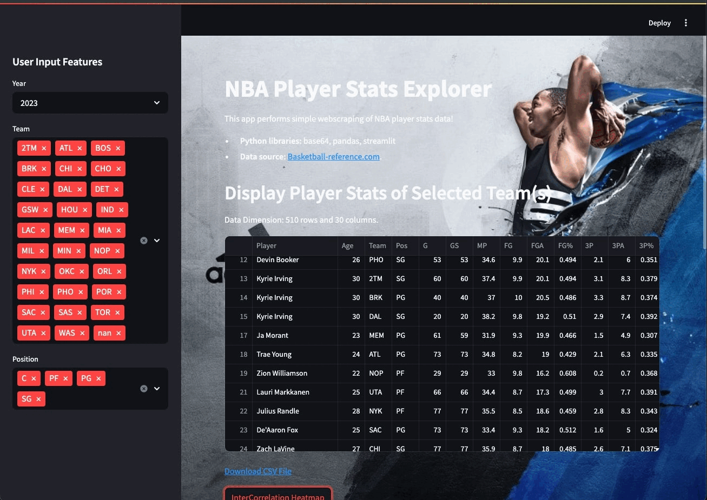
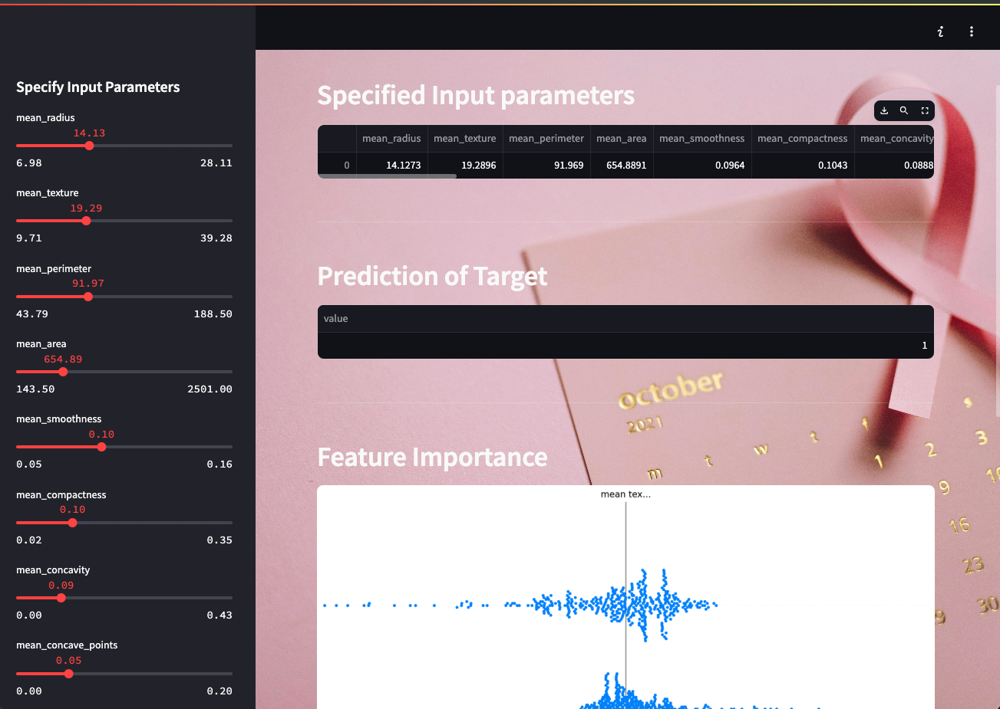

# MY Practice Git
 After conducting some basic tests, the actual project will be released after completing one paragraph at a time.
**When we're done with the mini project, we're officially starting the project!!**

### Mini very very basic Machine Learning Project

| ***finance***                                                                             | ***iris***                                                                                 | ***penguins***                                                                               |
|-------------------------------------------------------------------------------------------|--------------------------------------------------------------------------------------------|----------------------------------------------------------------------------------------------|
|  |  |  |

| ***NBA***                                                                                 |                                                                                                        |                                                                                        |
|-------------------------------------------------------------------------------------------|--------------------------------------------------------------------------------------------------------|----------------------------------------------------------------------------------------|
|  |  |                                                                                        |


```
penguins
https://dataprofeappr-pqtqnunb88ehcu56sbwupu.streamlit.app/

nba
https://kt6n46atuav7g45ltxzhqg.streamlit.app/
```


# Computer Vision
 * ***opencv***
 * ***yolo***
 * ***roboflow***
 * ***python***
 * ***pytorch***
 * ***tensorflow***
 * ***fastapi***
 * ***streamlit***
 * ***thesis analysis***


 * Automate modeling methods
 * distance measurement
 * size measurement
 * height measurement


## Progress Project (Detailed Later)
 * medical
   * brain
   * cancer and diabetes
   * x-ray lung cancer
   * ocular fundus
   * the possibility of acute myocardial infarction
 * face recognition
 * sign recognition
 * sports play
 * object detection
 * segmentation
 * automatic self-driving
 * artificial intelligence robotics
 * LLM
 * AI Generator